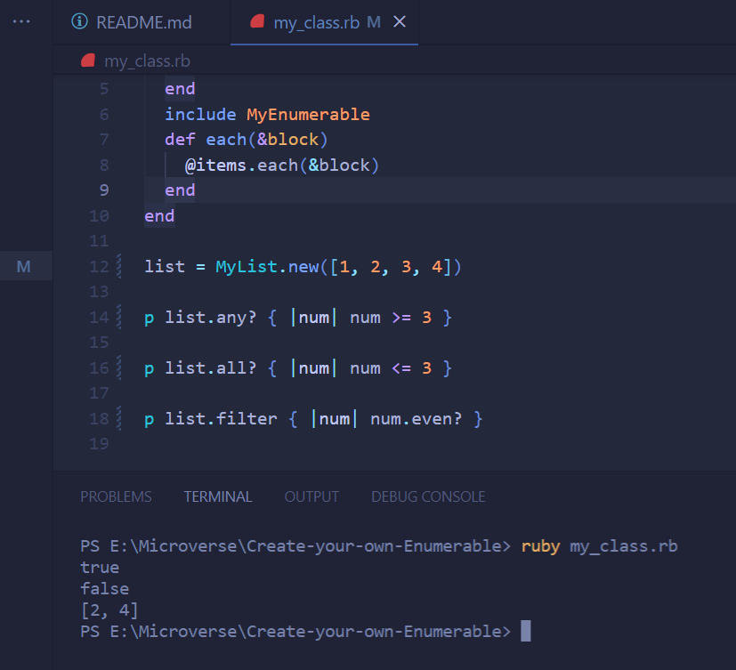

 

# Ruby Enumerable
In this project we will learn how to use a module inside class. For this we will create a class MyList and a module MyEnumerable. Our module MyEnumerable will implement a subset of the functionality of Enumerable.

# Requirements for this project

Please find the requirements for this project [here](https://github.com/microverseinc/curriculum-ruby/blob/main/simple-ruby/create_your_own_enumerable.md).

# screenshot 
Output

## Installation & Usage

- You need to have `git` and `ruby` installed on your local computer.
- Clone the repository by running `git clone https://github.com/mukhammadrizooff/Morse-Code.git`

## Technologies

- Ruby

## Authors

👤 **Silvia Tofana **

- GitHub: [@silviatofana](https://github.com/silviatofana)
- LinkedIn: [@silviatofana](www.linkedin.com/in/silvia-tofana-10b852186)
- Twitter: [@silviatofana](https://twitter.com/SilviaTofana)

👤 ** Maen Al-Khraisha **

- GitHub: [@githubhandle](https://github.com/maen1980)
- Twitter: [@twitterhandle](https://twitter.com/AlkhryshaM)
- LinkedIn: [LinkedIn](https://www.linkedin.com/in/ma-en-mohammad-303930100/)

## 🤝 Contributing

Contributions, issues, and feature requests are welcome!

Feel free to check the [issues page](../../issues/).

## Show your support

Give a ⭐️ if you like this project!

## Acknowledgments

- Hat tip to anyone whose code was used
- Inspiration
- etc

## 📝 License

This project is [MIT](./MIT.md) licensed.